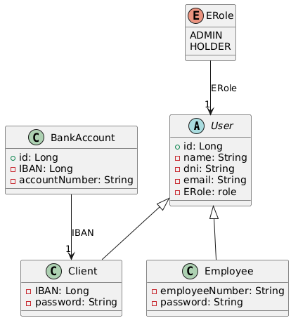

# 🏦 OnlineBank - Sistema de Gestión Bancaria
OnlineBank es una aplicación Java desarrollada con Spring Boot que simula un sistema básico de gestión 
bancaria. Permite registrar clientes y empleados, gestionar cuentas bancarias, y realizar operaciones a 
través de una API REST orientada a la seguridad y buenas prácticas.

# ◍ Funcionalidades principales
➠ *Registro de clientes con generación automática de IBAN*

➠ *Registro de empleados (con número de empleado generado internamente)*

➠ *Gestión de Admin:*

`Modificación parcial o total de clientes (usando PUT y PATCH)`

`Eliminación de clientes por parte de un administrador`

➠ *Validación de datos (email, DNI, IBAN, etc.)*

➠ Respuestas HTTP claras (200, 201, 204, 404)

➠ Mensajes de bienvenida y rutas públicas

➠ Pruebas con Postman y tests de integración con JPA

# ◍ Autenticación

Se ha comenzado a trabajar en la integración de autenticación JWT. Actualmente:

`✦ Se genera el token tras el login correctamente.`

`⚠️ Aún no se protege la API con verificación de JWT.`

**Esta funcionalidad será mejorada e integrada por completo en una futura versión.**

# ◍ Tecnologías utilizadas

+ Java 21
+ Spring Boot
+ Spring Data JPA
+ Spring Security
+ MySQL
+ Postman

# ◍ Estructura básica (UML): 

+ Tareas de trabajo: ⇝ Link Trello: https://trello.com/b/S45zPNRW/onlinebank